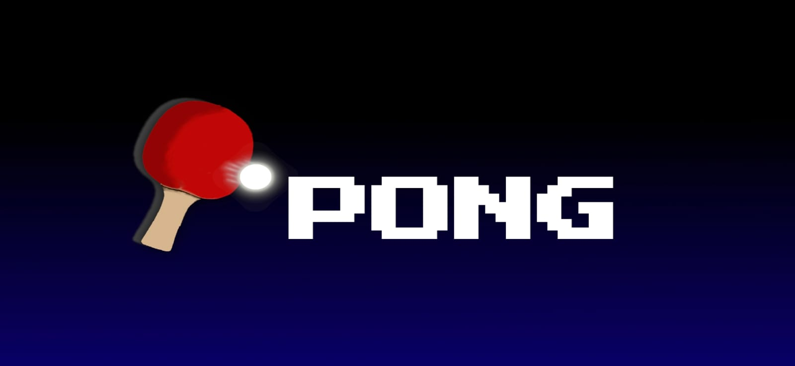
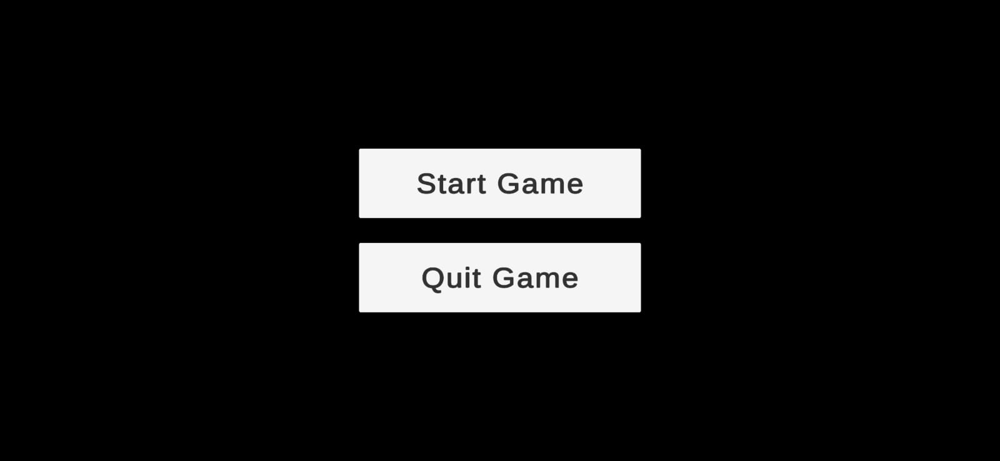
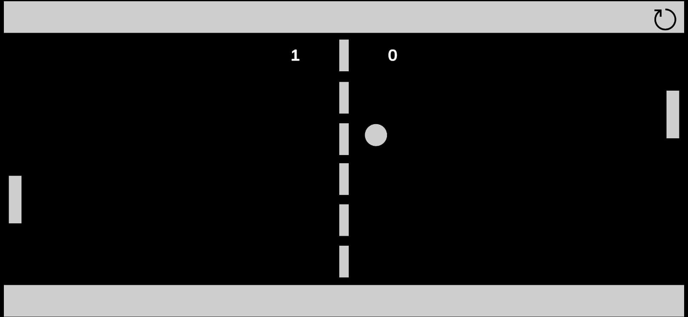
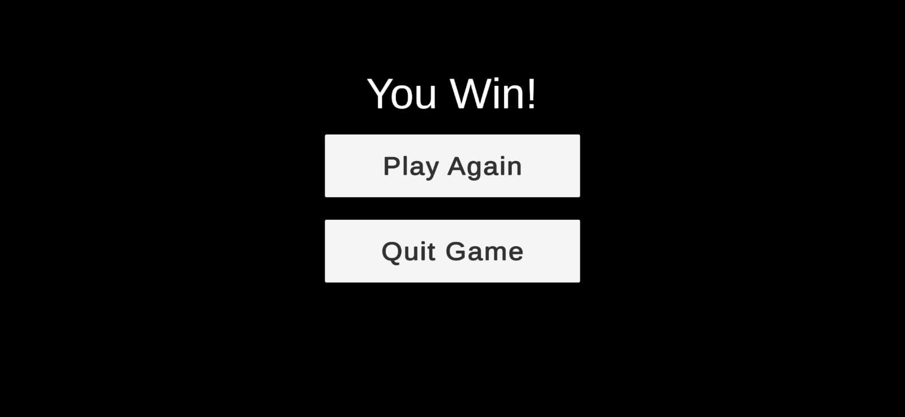
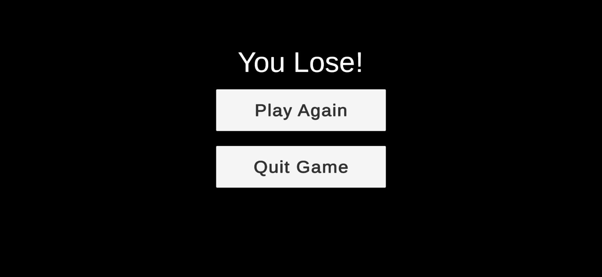

# Pong Game (Unity Android)

A minimalist Pong remake for Android made in Unity 2021.3.6f1.

## Features
- AI Paddle with velocity prediction
- Smooth player controls
- Responsive UI
- Audio feedback using AudioManager
- Android-ready build (touch controls)

## Built With
- Unity 2021.3.6f1
- C#
- Android SDK

## APK Download
Coming soon / [Itch.io Link here]

## Screenshots

## Credits
Developed by: Pioneer9110.\
Sound files sourced from: www.kenney.nl and [captaincrunch80](https://opengameart.org/content/3-ping-pong-sounds-8-bit-style)
